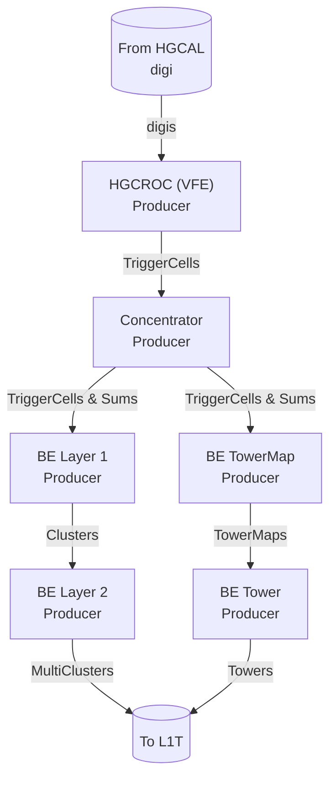
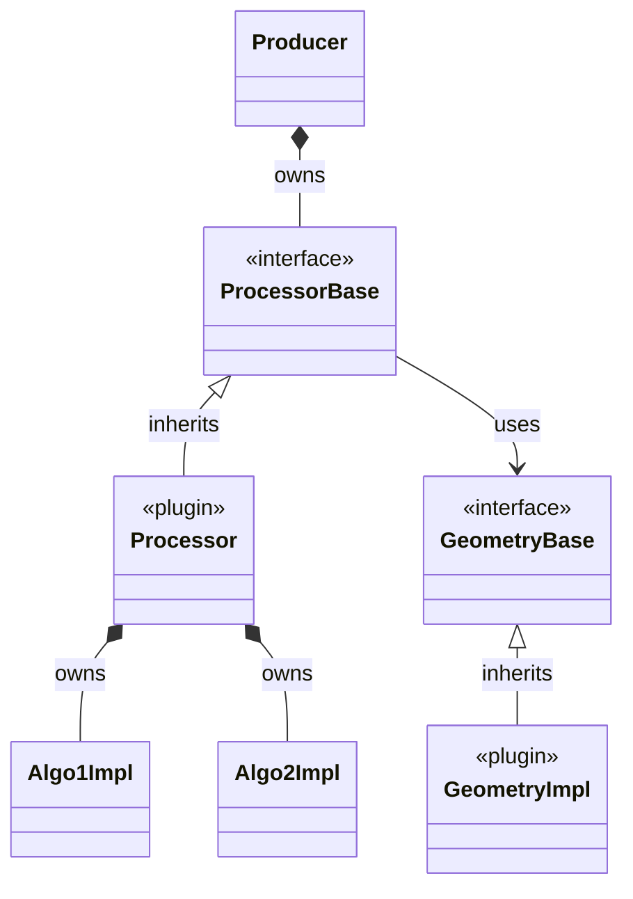
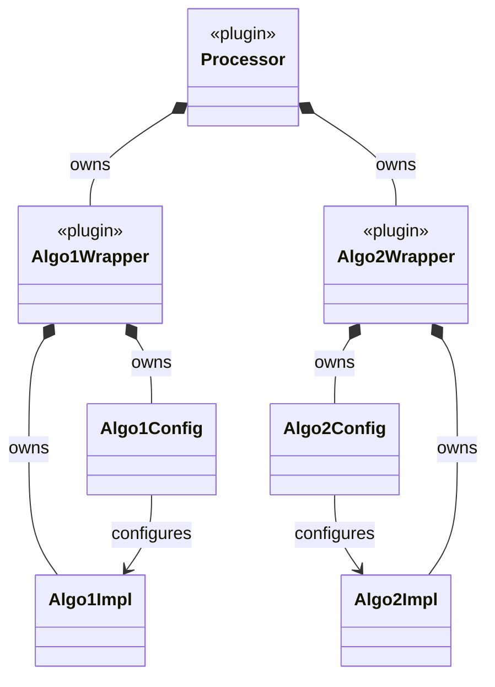

# Documentation of the HGCAL TPG simulation
This README is meant to contain technical documentation on the HGCAL TPG simulation. 
Introductory, user-oriented documentation and installation recipes can be found in the HGCAL TPG Simulation [Twiki page](https://twiki.cern.ch/twiki/bin/viewauth/CMS/HGCALTriggerPrimitivesSimulation).

## Code architecture
### Data Formats
Several data formats are defined in the [`DataFormats/L1THGCal`](../../DataFormats/L1THGCal) package:
- `HGCalTriggerCell` (derives from `L1Candidate`): defines a trigger cell object. Super trigger cells are also converted to trigger cell objects so that they are processed in a transparent manner by the back-end algorithms.
- `HGCalTriggerSums` (derives from `L1Candidate`): defines a module sum object.
- `HGCalClusterT` (derives from `L1Candidate`): template class from which are derived `HGCalCluster` (for clusters of trigger cells) and `HGCalMulticluster` (for clusters of clusters)
- `HGCalTower` (derives from `L1Candidate`): defines a tower object
- `HGCalTowerMap`: defines a collection of towers from a given detector layer 

### HGCAL TPG simulation stages
The HGCAL TPG simulation is split in a chain of producers:

- Front-end producers
    - `HGCalVFEProducer`: HGCROC trigger path simulation
    - `HGCalConcentratorProducer`: ECON-T simulation
- Back-end producers
    - `HGCalBackendLayer1Producer` and `HGCalBackendStage1Producer`: trigger cell path in the back-end Stage 1, the `Stage1` version is the latest version meant to be used with emulators 
    - `HGCalBackendLayer2Producer`: clustering in the back-end Stage 2
    - `HGCalTowerMapProducer`: towers in the back-end Stage 1
    - `HGCalTowerProducer`: towers in the back-end Stage 2
     
In addition to these `EDProducers` there is also an `ESProducer` responsible of the production of the HGCAL trigger geometry (`HGCalTriggerGeometryESProducer`), which is available for all the modules described above.

The data flow to and from these producers is illustrated in the diagram below.

<details>
<summary>Click to view the simplified flow chart</summary>



</details>


### Producers, Processors and Algorithms Implementations
Each producer simply handles the inputs and produces the outputs. It delegates the processing to Processors, which are plugins. The choice of Processor for a given producer is configurable. The actual algorithms are implemented in dedicated implementation classes (`AlgoImpl`). Instances of different `AlgoImpl` implementation classes can be called within a Processor (e.g. the cell energy linearization, the trigger cell summation, and the trigger cell energy compression in the VFE) and a given implementation can be used in several Processors.
In summary there are three main types of classes with specific roles:

- A Producer defines the inputs and outputs to be read from and stored in the Event
- A Processor defines a sequence of algorithmic blocks to be run. One Processor is meant to be the equivalent of a hardware processor in the TPG system (e.g. one FPGA). It therefore processes input data by blocks corresponding to the detector regions covered by the corresponding hardware processor.
- The Implementations contain the actual algorithmic blocks ran within a given hardware processor. 
  
Each stage/module in the HGCAL TPG is composed of these three types of classes, with the structure illustrated in the diagram below.

<details>
<summary>Click to view the simplified class diagram</summary>



</details>

### Standalone Emulators and Wrapping architecture
Algorithm implementations emulating dedicating firmware blocks are written in such a way that they can be executed in a standalone fashion outside CMSSW, for cross-validation with their firmware counterpart.
Therefore they are integrated within CMSSW by the mean of wrapper classes that are translating data and configurations between the CMSSW world and the standalone emulator world.

Algorithm implementations are configured by the mean of dedicated configuration objects built in the wrapper class. The wrapper class also perform the conversion of the input data from CMSSW data formats to standalone data formats, and convert back the output data from standalone data formats to CMSSW data formats. 

This wrapping structure is illustrated in the diagram below.

<details>
<summary>Click to view the simplified class diagram</summary>
    


</details>

## Details on the HGCAL TPG simulation stages

### Front-end: trigger path in the HGCROC
The simulation of the trigger path in the HGCROC (called also `VFE` in the code, for very-front-end) performs the following tasks:
- Linearisation of the input digitized charges (putting the ADC and TOT values to the same linear scale), taken from the HGCAL `digis`
- Forming trigger cells (sums of 4 or 9 sensor cells) from linearized input charges
- Compression of the trigger cell energies on a floating point format

These steps are called from [`plugins/veryfrontend/HGCalVFEProcessorSums.cc`](plugins/veryfrontend/HGCalVFEProcessorSums.cc), and configured with [`python/l1tHGCalVFEProducer_cfi.py`](python/l1tHGCalVFEProducer_cfi.py). This configuration can be customized with customization functions available in [`python/customVFE.py`](python/customVFE.py). The actual implementations of the processing steps are stored in [`src/veryfrontend`](src/veryfrontend).

:warning: To be noted that at the moment the calibration of the trigger cell charges to energies in GeV is called from there while in reality it will be done in the ECON-T.

### Front-end: ECON-T
The ECON-T simulation implements several data reduction strategies applied on the trigger cells sent from the HGCROC trigger path. The data reduction strategies available are the following:
- `Threshold`: Selecting a variable subset of trigger cells passing a threshold on their transverse energy. This is the one used as default.
- `BestChoice`, `BC`: Selecting a fixed number of trigger cells per detector module. The trigger cells with the highest transverse energies are retained. 
- `SuperTriggerCell`, `STC`: Aggregating further trigger cells into coarser objects called Super Trigger Cells. Several flavours of Super Trigger Cells are available and configurable.
- `AutoEncoder`: Applying trigger cell data compression with an auto-encoder neural network.

Different data reduction strategies can be configured in the different sub-detectors (CE-E, CE-H-Si, CE-H-Sc), and in particular `BestChoice` can be used in the CE-E with `SuperTriggerCell` in the CE-H (which corresponds to the so called `BC+STC` algorithm).

The ECON-T simulation also builds module sums (called `trigger sums` in the code), which are energy sums over entire detector modules. All trigger cells, or only those not selected by the selection algorithms described above, can be summed in module sums.

These steps are called from [`plugins/concentrator/HGCalConcentratorProcessorSelection.cc`](plugins/concentrator/HGCalConcentratorProcessorSelection.cc), and configured with [`python/l1tHGCalConcentratorProducer_cfi.py`](python/l1tHGCalConcentratorProducer_cfi.py). This configuration can be customized with customization functions available in [`python/customTriggerCellSelect.py`](python/customTriggerCellSelect.py) and [`python/customTriggerSums.py`](python/customTriggerSums.py):
```python
from L1Trigger.L1THGCal.customTriggerCellSelect import custom_....
from L1Trigger.L1THGCal.customTriggerSums import custom_....
process = custom_....(process)
```
The actual implementations of the algorithms are stored in [`src/concentrator`](src/concentrator).

:warning: To be noted that the calibration step from charges to energies in GeV is currently called from the HGCROC trigger path simulation, while it is in reality done in the ECON-T.

### Back-end: Clustering
Selected trigger cells and STCs are taken as input of the back-end clustering algorithms. Trigger cell objects are created from STCs beforehand so that they are transparently processed in the back-end simulation in an uniform way.
Trigger cells go through two consecutive modules, one for the Stage 1 simulation (also called `Layer1` in the code) and one for the Stage 2 simulation (also called `Layer2` in the code), out of which clusters of trigger cells are produced.

#### Stage 1
As default, the Stage 1 simulation is just a pass-through. A bit-level emulation of the 2022 version of the Stage 1 firmware is also available, which packs input trigger cells into `r/z` bins, sorts them by transverse energy and selects the highest-energetic trigger cells in each `r/z` bin.
Deprecated Stage 1 algorithms,  which are layer-by-layer 2D clustering algorithms are also implemented, but they are not foreseen to be used anymore in the TPG system.  

The different Stage 1 processing versions are implemented in:
- [`plugins/backend/HGCalBackendLayer1Processor2DClustering.cc`](plugins/backend/HGCalBackendLayer1Processor2DClustering.cc): original implementations of the 2D layer clusterings and pass-through
- [`plugins/backend/HGCalBackendLayer1Processor.cc`](plugins/backend/HGCalBackendLayer1Processor.cc): first implementation of Stage 1 trigger cell truncation
- [`plugins/backend/HGCalBackendStage1Processor.cc`](plugins/backend/HGCalBackendStage1Processor.cc): latest Stage 1 processor calling the 2022 Stage 1 emulator

And actual implementations of the algorithms are stored in [`src/backend`](src/backend). These processors are configured from [`python/l1tHGCalBackEndLayer1Producer_cfi.py`](python/l1tHGCalBackEndLayer1Producer_cfi.py). Customization functions are available in
- [`python/customClustering.py`](python/customClustering.py): old 2D layer clustering customization
- [`python/customNewProcessors.py`](python/customNewProcessors.py): contains Stage 1 truncation and emulator customization

#### Stage 2 clustering
The Stage 2 is responsible of building the final 3D clusters, initially from 2D layer clusters and now directly from trigger cells. The default Stage 2 clustering algorithm is the so-called `HistoMax`, which refers to the way the cluster building is seeded. 
The `HistoMax` 3D clustering is divided in several steps:
- Histogramming: trigger cell transverse energies are projected into a 2D histogram in the $(r/z, \phi)$ space
- Smoothing: smoothing kernels are applied on the 2D histogram in both $r/z$ and $\phi$ dimensions
- Seeding: local maxima in the 2D histogram, passing a given transverse energy threshold, are selected as seeds
- Clustering: trigger cells are clustered to seeds based on a distance in the $(x/z, y/z)$ space
- Cluster building: cluster properties (energy, position, cluster shapes) are computed from the clustered trigger cells

By default the `HistoMax` clustering algorithm used is the original simulation based on floating point calculation. A bit-level emulation of the 2022 version of the Stage 2 firmware (based on the same algorithm described above) is also available.

The different Stage 2 processing versions are implemented in:
- [`plugins/backend/HGCalBackendLayer2Processor3DClustering.cc`](plugins/backend/HGCalBackendLayer2Processor3DClustering.cc): original floating-point simulation of different clustering algorithms (including the `HistoMax` algorithm) 
- [`plugins/backend/HGCalBackendLayer2Processor3DClustering_SA.cc`](plugins/backend/HGCalBackendLayer2Processor3DClustering_SA.cc): bit-level Stage 2 clustering emulator

And actual implementations of the algorithms are stored in [`src/backend`](src/backend) and [`src/backend_emulator`](src/backend_emulator) for the bit-level emulator. These processors are configured from [`python/l1tHGCalBackEndLayer2Producer_cfi.py`](python/l1tHGCalBackEndLayer2Producer_cfi.py), and [`python/hgcalBackendLayer2_fwClustering_cfi.py`](python/hgcalBackendLayer2_fwClustering_cfi.py) for the bit-level emulator. Customization functions are available in
- [`python/customClustering.py`](python/customClustering.py): clustering algorithms based on floating-point calculation
- [`python/customNewProcessors.py`](python/customNewProcessors.py): customization of the bit-level emulator

#### Cluster properties
Cluster properties computed after the cluster include cluster shape variable meant to encode the longitudinal and lateral development of the reconstructed showers. These cluster shape variables can primarily be used for shower identification (e.g. electromagnetic vs hadronic showers). A set of cluster shape variables is computed in a dedicated class [`src/backend/HGCalShowerShape.cc`](src/backend/HGCalShowerShape.cc) and filled in the cluster objects.

In addition to cluster shape variables, cluster properties can include different energy interpretations in addition to the default energy value of the cluster. These energy interpretations are defined as plugins in [`plugins/backend`](plugins/backend), deriving from [`interface/backend/HGCalTriggerClusterInterpreterBase.h`](interface/backend/HGCalTriggerClusterInterpreterBase.h). One such interpretation plugin is currently implemented:
- [`plugins/backend/HGCalTriggerClusterInterpretationEM.cc`](plugins/backend/HGCalTriggerClusterInterpretationEM.cc): energy interpretation to be used for electrons and photons 


### Back-end: Tower building
In parallel with the reconstruction of clusters, a traditional map of fixed towers is also reconstructed in the $(\eta,\phi)$ plane similar in size as existing Phase 1 trigger towers. These towers can be built from module sum transverse energies, from trigger cell transverse energies or from a combination of the two. There are also different ways in which these input objects can be mapped to towers, in particular:
- Input objects can be mapped to towers according to their $(\eta,\phi)$ position, similar to how histogram are typically filled
- Input energies can be shared between several neighbor towers according to the intersection areas of the input objects with the towers

The default tower building is based on module sums only and module sums are mapped to towers simply based on their $(\eta,\phi)$ position, without sharing of their energy.

The tower building is done is two steps, which at the moment still inherit from the old TPG architecture:
- [`plugins/backend/HGCalTowerMapProcessor.cc`](plugins/backend/HGCalTowerMapProcessor.cc): creates a set of tower maps, one for each detector layer
- [`plugins/backend/HGCalTowerProcessor.cc`](plugins/backend/HGCalTowerProcessor.cc): sums the previously built towers maps into the final tower objects 

These processors are configured from [`python/l1tHGCalTowerMapProducer_cfi.py`](python/l1tHGCalTowerMapProducer_cfi.py) and [`python/l1tHGCalTowerProducer_cfi.py`](python/l1tHGCalTowerProducer_cfi.py). Customization functions are available in [`python/customTowers.py`](python/customTowers.py).


## Utilities
### Trigger geometry
The trigger geometry utility provides a unified interface to navigate between different geometrical objects and map hardware objects to the detector geometry. It comprises:
- Navigation between sensor cells and trigger cells
- Mapping between detector modules (hexaboards, tileboards) and trigger cells
- Mapping between modules and front-end optical links (lpGBT)
- Mapping between Stage 1 FPGAs and detector modules as well as lpGBTs
- Mapping between Stage 1 FPGAs and Stage 2 FPGAs

It also provides an interface to access the different underlying HGCAL geometries and topologies from the different sub-detectors (CE-E, CE-H-Si, CE-H-Sc), as well as some helper functions:
- Retrieve the number of elinks per detector module
- Retrieve the position of a trigger cell or of a detector module
- Retrieve active detector layers used in the trigger
- Check if a detector module is used in the trigger or disconnected (for instance if the corresponding detector layer is not used)

To be noted that previous versions of the trigger geometry utility implemented a way to retrieve trigger cell neighbors, which was used for 2D topological clustering. This feature is not available anymore in the currently existing versions.

Two versions of the trigger geometry utility are currently available:
- `HGCalTriggerGeometryV9Imp3` is the one used as default and implements all the link mappings between the front-end and the back-end, and within the back-end. The tag `V9` in the name means that it can be used with all detector geometries $\geq$ V9.
- `HGCalTriggerGeometryV9Imp2` is an older version in which the link mappings between the front-end and the back-end are not implemented.

They are stored in the [`geometries` plugin directory](plugins/geometries), and follow the interface defined in  [`interface/HGCalTriggerGeometryBase.h`](interface/HGCalTriggerGeometryBase.h). The trigger geometry utility is built by the ESProducer [`plugin/HGCalTriggerGeometryESProducer.cc`](plugins/HGCalTriggerGeometryESProducer.cc) so that it is made available through the `EventSetup`.

The parameters for the various trigger geometries are defined in [`python/customTriggerGeometry.py`](python/customTriggerGeometry.py), and the customization functions here can be used to switch from one trigger geometry to an other.
The default parameters of the trigger geometry are defined in [`python/l1tHGCalTriggerGeometryESProducer_cfi.py`](python/l1tHGCalTriggerGeometryESProducer_cfi.py) and alternative geometries can be used with the customization functions:
```python 
from L1Trigger.L1THGCal.customTriggerGeometry import custom_....
process = custom_....(process)
```

Link mappings accessed by the trigger geometry are provided as JSON files (`hgcal_trigger_link_mapping_*.json`) available in `L1Trigger/L1THGCal/data/`. Note that once integrated in CMSSW releases, these data files are stored on `cvmfs` under `$CMSSW_DATA_PATH/data-L1Trigger-L1THGCal` and can also be viewed from the Github [cms-data/L1Trigger-L1THGCal](https://github.com/cms-data/L1Trigger-L1THGCal) repository.


### Trigger tools
Functions used in different places of the HGCAL TPG simulation are implemented in the utility class [`src/HGCalTriggerTools.cc`](src/HGCalTriggerTools.cc). It implements in particular:
- Queries of various `DetId` properties, hiding to the user the underlying variety of the detector ids used in HGCAL
- Functions to get access to information on positions, based on the trigger geometry
